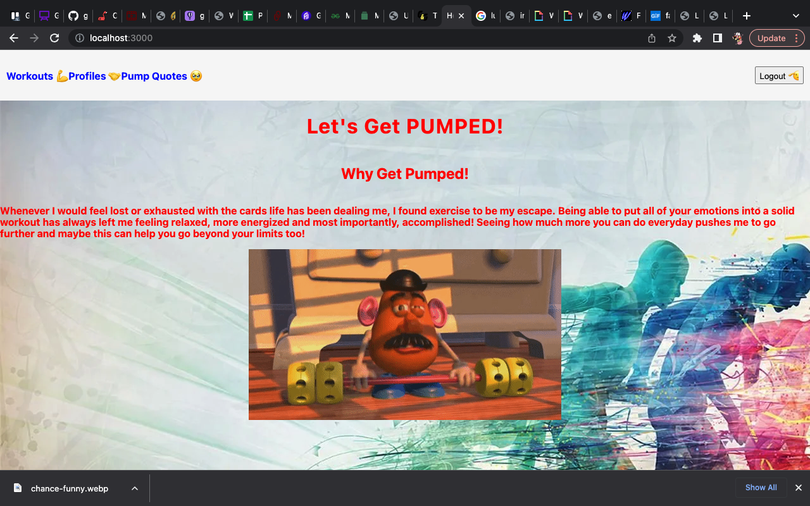

# Get Pumped Tracker

## About

I loved watching cartoons as a kid and some shows have stuck with me throughout my life. These are just a few I enjoyed watching. 

The 90s Cartoon Quiz Game is a fun quiz testing the players knowledge on some popular 90s cartoons. The player will have 25 secs to answer all 8 questions within the selected category. If time runs out, the game is over! See if you can get a perfect score!

Here is a link to my [90s Cartoon Quiz Game!](https://90s-cartoon-quiz.netlify.app/)

Enjoy!

## Rules

- Select a category to start the quiz

- Answer all 8 questions to find out your score
  
- Each question is worth 1 point
  
- If time runs out, its Game Over!

## Technologies Used 

-HTML

-CSS

-Javascript

-[Whimsical](https://whimsical.com/getting-started-boards-QqL4VfuNCsszsBUCWumEn1)

## Thanks to

-Background image from [freepik](https://www.freepik.com/free-photos-vectors/cartoon-background)

-Font style from [Google Fonts](https://fonts.google.com/specimen/Press+Start+2P)

-Sound effects from [MyInstants](https://www.myinstants.com/en/index/us/)

## Coming Soon

90s-Cartoon-Quiz-Game will be updated to include:

-New cartoon quizes to choose from

-More images and audio to bring back some 90s nostaligia

-Mobile version on the way!